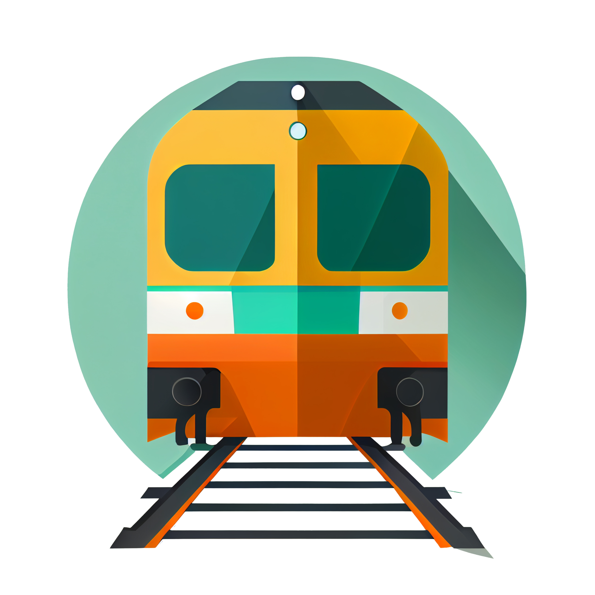

    <h1>Harry's Train </h1>

### Description

Harry's has a special train. His train is made out of a locomotive and an infinite number of wagons. Wagons can be marked with a single character (letter, number or any symbol on the keyboard). Initially the train has only the first wagon marked with "#" and a mechanic responsible to perform predefined [tasks](###Tasks).   

Harry's train will be [implemented](#implementation-in-c) using <b>Data Structures & Algorithms</b> in C.

### Tasks

Tasks are of the following types: Update, Search, Query, Execute.   
Update & Search tasks are added to a queue and executed only when EXECUTE is read from the input.    
Query tasks are executed directly when read.    

<b>1. Update    </b>    

MOVE_LEFT - moves one cell to the left  
MOVE_RIGHT - moves one cell to the right   
WRITE [C] - write [C] on the current wagon/position of the mechanic   
CLEAR_CELL - decouple the wagon where the mechanic is located   
CLEAR_ALL - decouple all the wagons; train returns to initial state     
INSERT_LEFT - insert a new wagon to the left of the mechanic's position; moves the mechanic on the new wagon        
INSERT_RIGHT - insert a new wagon to the right of the mechanic's position; moves the mechanic on the new wagon             

SEARCH [STR] - searches a given string; iterates through every position at least one time starting from the mechanic's current position to the right      
SEARCH_LEFT [STR] - searches a given string to the left; stops when sentinel is met    
SEARCH_RIGHT [STR] - searches a given string to the right; stops when sentinel is met       

<b>2. Query     </b>    

SHOW_CURRENT - shows character on the mechanic's position              
SHOW - shows all train wagons/characters              
SWITCH - switches the order in which tasks are dequeued; head/tail

<b>3. Execute   </b>    

EXECUTE - dequeues and executes the next task

## Implementation in C

<b>Train</b> - Doubly linked list with sentinel (locomotive)  
<b>Tasks Queue</b> - Doubly linked list (w/ pointers to head & tail)

1. <b>./include/   </b> 
    * tasks.h       
        - define tasks (e.g. #define ML "MOVE_LEFT") & tasks/functions headers  
    * list.h    
        - train implementation as a doubly linked list
    * queue.h   
        - tasks queue implementation as a doubly linked list with pointers to the head & tail of the queue
    * functions.h
        - header for other functions used in implementation
    * tema1.h
        - main header (for tema1.c) and input/output defines

2. <b>./lib/       </b> 
    * list.c    
        - implementation of functions used to init/operate/destroy "train"
    * queue.c   
        - implementation of functions used to init/enqueue/dequeue/destroy tasks queue
    * tasks.c
        - implementation of every task the mechanic has to perfom   
    * functions.c      
        - implementation of other functions used in the main .c file (tema1.c)  

3. <b>./tema1.c    </b> 
    * fopen() input and output files
    * init tasks-queue and train-list; place the mechanic on the first wagon ("#")  
    * declare int tl = 0 (used for the SWITCH task)
    * read from input "len" variable used in the while loop to determine how many tasks will be performed
    * while (len > 0) { ... len--; }
        - read next string using fscanf
        - Using a cascade of if-else we will be comparing (strcmp) the string read in the variable "line" to the list of tasks defined in tasks.h;   
            a) if line == EXECUTE we will dequeue and execute the next task from the queue; using variable "tl" we will determine if we need to dequeue from head or tail; execute() will call the calculateStringValue(..) function in functions.c and will return an int value resembling the task (see tasks.h); we use switch to call the function that will manage task execution (e.g. moveLeft(..))
            b) else we will continue comparison for SHOW_CURRENT, SHOW, SWITCH tasks;
            c) we use nextIsChar(..) function to determine if the task is part of the ones that come with a [C] or [STR];
            d) we enqueue the task to the tasks-queue
    * destroy queue/train & free allocated memory

## Tests locally    

Total: 100.0/100    
Valgrind: 20/20     
